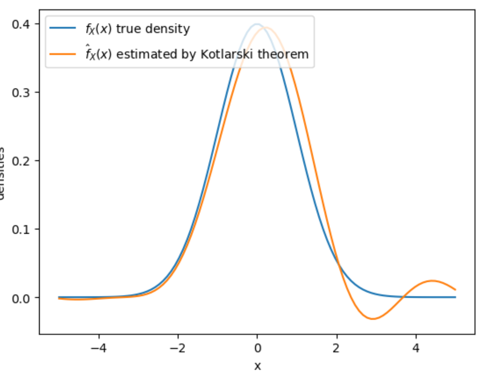

# py_kotlarski
 A python implementation of Korlarski deconvolution.

## Usage

Generate random variables.
```python
import numpy as np

X = np.random.normal(size=1000)
e1 = np.random.normal(loc=2, size=1000)
e2 = np.random.normal(loc=2, size=1000)
Y1 = X + e1
Y2 = X + e2
```
Run Kotlaski to get the density function of $X$, $e_1$, and $e_2$ from joint distributino of $Y_1$ and $Y_2$

```python
import pykotlarski as kt
kot = kt.Kotlarski(Y1, Y2)
# density of X evaluated at 0.5
kot.fx(0.5)
# density of e1 evaluated at 0.5
kot.fe1(0.5)
# density of 32 evaluated at 0.5
kot.fe2(0.5)
```

An example that shows it works. 
```python
import matplotlib.pyplot as plt

x_plot = np.linspace(-5,5,100)
plt.plot(x_plot, scipy.stats.norm.pdf(x_plot))

est_plot = []
for x in x_plot:
    est_plot.append(kot.fx(x))
plt.plot(x_plot, est_plot)
```
<!-- -->


## Kotlarski's Theorem (1967)

Theorem (Kotlarski, 1967): Let $\varepsilon_1, \varepsilon_2$, and $X$ be three independent real-valued random variables and define $Y_1=X+\varepsilon_1$ and $Y_2=X+\varepsilon_2$. If the characteristic function of $\left(Y_1, Y_2\right)$ does not vanish, then the joint distribution of $\left(\mathrm{Y}_1, \mathrm{Y}_2\right)$ determines the distributions of $\varepsilon_1, \varepsilon_2$, and $X$ up to a change of the location.

## Steps

<!-- My steps are based on Li and Vuong (1998) and Krasnokutskaya (2011).

1. Estimate the joint characteristic function of $(Y_1, Y_2)$ by its empirical counterpart.
   $$\hat{\Psi}(t_1, t_2) = \frac{1}{n} \sum_{j=1}^n \exp \left(i t_1 \cdot Y_{1j}+i t_2 \cdot Y_{2j}\right)$$

2. Estimate the derivative of $\hat{\Psi}(t_1, t_2)$ with respect to $t_1$ by
   $$\hat{\Psi}_1(t_1, t_2) = \frac{1}{n} \sum_{j=1}^n i  \cdot Y_{1j}\exp \left(i t_1 \cdot Y_{1j}+i t_2 \cdot Y_{2j}\right)$$

3. Estimate the characteristic functions by
    $$
    \begin{aligned}
    \widehat{\Phi}_{X}(t) & =\exp \left(\int_0^t \frac{\widehat{\Psi}_{1}\left(0, u\right)}{\widehat{\Psi}\left(0, u\right)} d u-i t E\left[X\right]\right), \\
    \widehat{\Phi}_{\varepsilon_1}(t) & =\frac{\widehat{\Psi}(t, 0)}{\widehat{\Phi}_{X}(t)}, \\
    \widehat{\Phi}_{\varepsilon_2}(t) & =\frac{\widehat{\Psi}(0, t)}{\widehat{\Phi}_{X}(t)} .
    \end{aligned}
    $$

4. Transform the characteristic functions to density functions, where $T$ is a smoothing parameter.
    $$\hat{f}\left(u\right)=\frac{1}{2 \pi} \int_{-T}^T \exp \left(-i t u\right) \widehat{\Phi}(t) d t$$ -->

Check my steps [here](./docs/steps.png)